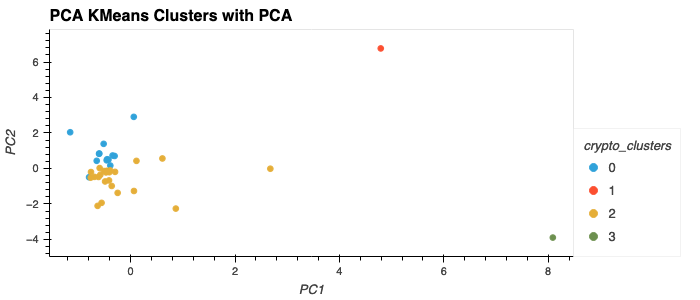

# CryptoClustering: Unveiling Cryptocurrency Market Dynamics

## Overview
This project explores Crypto Clustering, predicting cryptocurrency fluctuations over 24-hour and 7-day intervals, utilizing Principal Component Analysis (PCA) to enhance clustering outcomes. Clustering can be used by analysts to recognize market trends and identify otherwise obscure market segments. 

### Objective
The goal of this project is to leverage PCA for improved clustering, to better understand cryptocurrency market behaviors and to test the insights with and without using Principal Component Analysis (PCA). 

## Data Source

The dataset employed in this project originates from the cryptocurrency market data, provided during my participation in a data analytics bootcamp, the [source](https://git.bootcampcontent.com/University-of-Minnesota) is however restricted. 

## Techniques 

### Data Preparation
- **Data Loading**: Loaded `crypto_market_data.csv`, comprising various features relevant to cryptocurrency performance.
- **Data Normalization**: Utilized `StandardScaler()` to normalize features, ensuring uniformity in data scale for accurate clustering analysis.

### Clustering Analysis
* Comparing original scaled data with the optimized PCA data 

## Key Findings

- **PCA Effectiveness**: Using PCA significantly improved the clustering quality, making the clusters more distinct and easy to interpret.
- **Optimal Cluster Count**: Using the PCA-transformed data and elbow curves helped to determine that four clusters was the optimal number in this case.
- **Impact of Dimensionality Reduction**: The use of PCA not only simplifies the dataset but also enhances the clustering, facilitating a more nuanced understanding of cryptocurrency market dynamics.

## Conclusion

This project underscores the utility of PCA in enhancing data clustering, particularly in the complex and fast-evolving cryptocurrency market. Through thoughtful analysis and strategic data manipulation, we uncover patterns and insights that could inform investment strategies and market analysis. Currencies that form their own clusters, like Etherlend and Celsius-degree, exhibit volatility patterns not found in the majority of currencies. Reducing the dimensions by utilizing PCA helped identify these outliers. 

## Future Directions

In future projects, I plan to explore other dimensionality reduction techniques such as t-Distributed Stochastic Neighbor Embedding (t-SNE) and Uniform Manifold Approximation and Projection (UMAP) to compare their effectiveness in clustering cryptocurrencies. These methods could offer different insights into the market dynamics and help in identifying niche segments more accurately.
